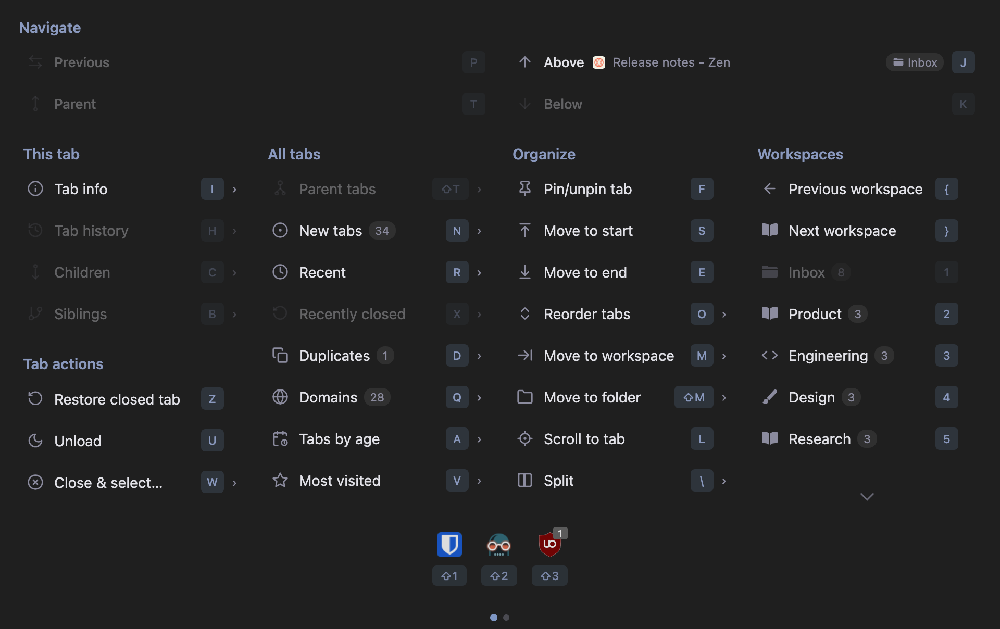
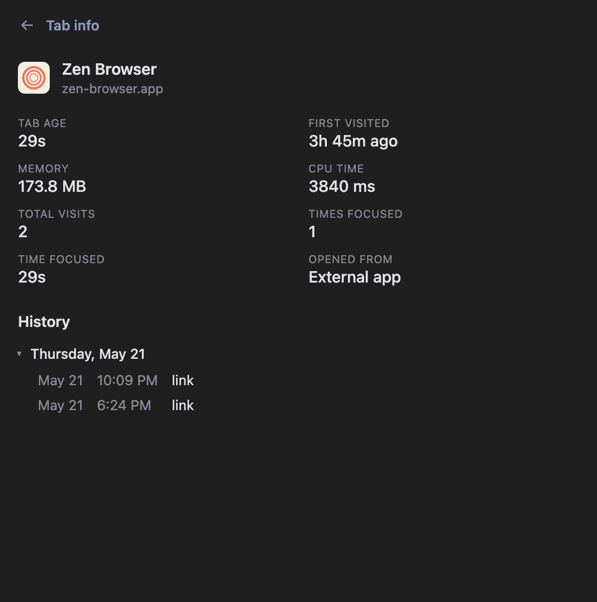
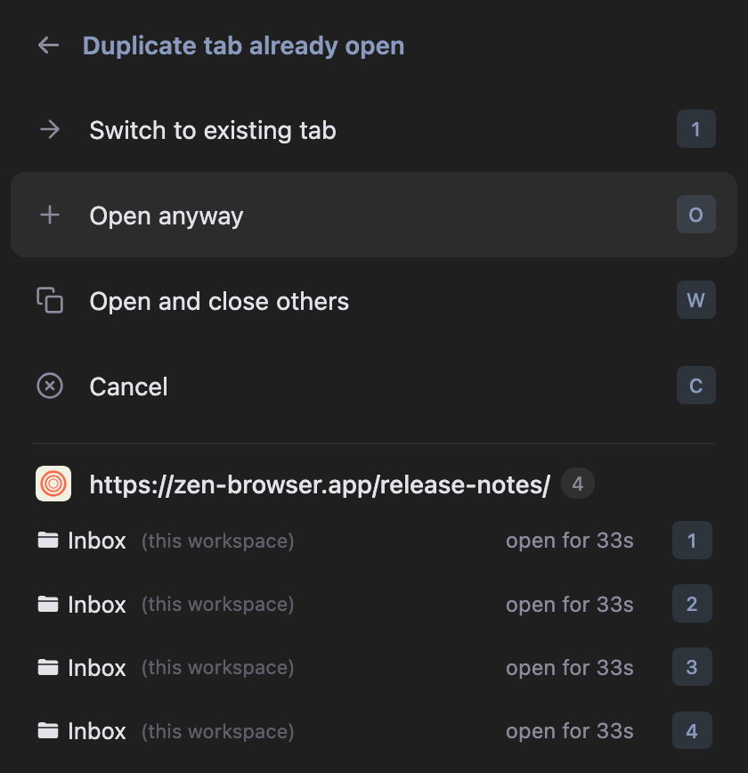
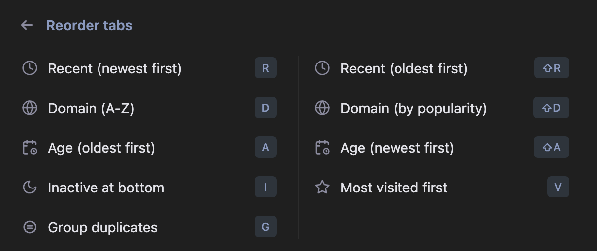
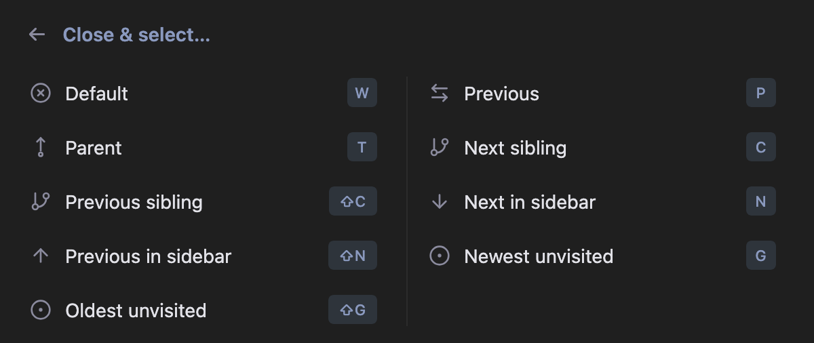

# ErgoZen

A command palette for [Zen Browser](https://zen-browser.app/). Discoverable chord shortcuts for tabs, workspaces, splits, and more — drive it from the keyboard or the mouse.

Formerly **Zen Tabs Panel**.

ErgoZen surfaces dozens of actions across tabs, workspaces, splits, and more — far more than Zen exposes by default. Everything starts with one leader chord (`⌘.` on macOS, `⌃.` on Windows/Linux), followed by a short sequence of keys. For example, `⌘.` then `R` opens recent tabs; `⌘.` then `R` then `2` switches to the second most recent tab. The same sequence works whether you see the menu or not: type it quickly and the action fires immediately; pause, and the menu pops up showing every available next key. Common actions become muscle memory while less-used ones stay easy to discover. The palette is keyboard-first but fully mouse-friendly.

> [!NOTE]
> Windows and Linux have not been tested, but should work in theory.

<p align="center">
  
</p>

<p align="center">
  
</p>

<p align="center">
  
</p>

<p align="center">
  
</p>

<p align="center">
  
  
</p>

## Install

> [!CAUTION]
> This extension uses internal Zen APIs which could change and break with any Zen update. Use at your own risk.
>
> **Version 0.4.4** · Tested on Zen Browser 1.19.11b (Firefox 150.0.1)

### Quick install (macOS)

```sh
/bin/sh -c "$(curl -fsSL https://raw.githubusercontent.com/cfilipov/ergozen/main/install.sh)"
```

This automatically sets the required `about:config` flags, downloads the latest release, and installs it into your Zen profile. Run the same command to update. Restart Zen after installing.

### Manual install

#### 1. Set required `about:config` flags

Open `about:config` in Zen and set both of these:

| Flag | Value | Purpose |
|---|---|---|
| `xpinstall.signatures.required` | `false` | Allows installing extensions without a Mozilla signature |
| `extensions.experiments.enabled` | `true` | Allows extensions to use Experiment APIs |
| `extensions.autoDisableScopes` | `14` | Keeps profile-installed add-ons from being disabled as sideloaded extensions |

#### 2. Install the extension

1. Download `ergozen.xpi` from the [latest release](../../releases/latest).
2. Open `about:addons` in Zen
3. Click the gear icon (⚙) › **Install Add-on From File...**
4. Select the downloaded `.xpi` file

The extension will persist across browser restarts.

#### 3. Install companion mods (optional)

1. Open the command palette (`⌘.` or `⌘⌥.`) and press `,` to open settings
2. Under **Companion Zen Mods**, click **Install** next to any mods you want
3. The mods will appear in `about:preferences` › Zen Mods where you can toggle them

### Why Installation Isn't Straightforward

This extension uses a Firefox **Experiment API** to access Zen's internal browser APIs (workspace switching, cross-workspace tab management, chrome DOM manipulation). Experiment APIs are a privileged extension mechanism that aren't allowed on the public Firefox Add-ons site (AMO), so the extension can't be distributed through normal channels.

This means two `about:config` flags must be enabled to install it.

## Features

**Command palette** (`⌘.` / `⌘⌥.` on macOS, `⌃.` on Windows/Linux, or toolbar icon) - a Zen-styled floating panel with:

- Navigate section - directional actions for Previous, Parent, Above, and Below on the first page, with Back and Forward on the second page. Rows that target a tab show a live preview with the target favicon/title; hovering or arrow-keying highlights and scrolls to the target in the sidebar.
- Child tabs - list all tabs spawned from the current tab
- Sibling tabs - list all tabs that share the same parent as the current tab
- Parent tabs - list tabs that have spawned children, with child counts and drill-down into each parent's children
- Tab history - back/forward history of the current tab with B/F shortcuts for immediate back/forward
- New tabs - list tabs opened in the background you haven't looked at
- Newest/oldest unvisited - jump directly to the newest or oldest background tab you have not visited yet
- Tabs by last visited - all tabs sorted by recency. Hovering or arrow-keying through any tab list highlights and scrolls to the tab in the sidebar.
- Tab info - detailed view of the current tab: age, memory/CPU usage, visit history (grouped by date, collapsible), and duplicate tab detection with close buttons
- Duplicates - view all duplicate tabs across all workspaces, grouped by URL, with workspace indicators, tab age, hover preview, and close buttons. Duplicate tabs are marked with an amber "D" badge in the sidebar; unvisited tabs use a matching blue "N" badge.
- Duplicate tab prompt - optionally intercepts attempts to open a URL that is already open elsewhere, with choices to switch to the existing tab, open anyway, open and close the other duplicate tabs, or cancel. The switch option previews and scrolls to the existing tab.
- Domains - browse tabs grouped by domain with drill-down
- Tabs by age - list all tabs by age with age badges and close buttons for cleaning up old tabs
- Most visited - list tabs sorted by browser history visit count, most visited first
- Move to workspace - move tabs to another workspace without switching away (placed at top of target workspace's tab list). Supports multiselected tabs (⌘-click).
- Move to folder - move the current tab to a Zen folder
- New container tab - reopen the active tab in a Firefox container
- Move tab to start / end of tab bar
- Reorder tabs - submenu with sort options: by recent, by domain (alphabetical or popularity), by age, most visited, inactive at bottom, group duplicates
- Scroll to current tab - scroll the sidebar to center the active tab
- Unload tab - discard from memory
- Close & select - close the current tab and explicitly choose which tab to focus next: default (whatever `⌘W` would do, with the predicted successor previewed live), previous (last-active), parent, next/previous sibling, next/previous tab in the vertical bar, or newest/oldest unvisited tab. Each row shows the actual target tab's favicon and title; hover or arrow-key to highlight it in the sidebar; rows with no available target are disabled.
- Pin/unpin tab — toggle pinned state of the active tab (refuses to act on Essentials)
- Copy URL as Markdown — copies the active tab as `[Title](URL)` to the clipboard
- Restore closed tab — reopens the most recently closed tab in this window via SessionStore
- Next/Previous workspace — cycle through workspaces with wraparound
- Workspace tools - submenu for changing the active workspace icon, changing its name, editing its theme, setting its container profile, creating/deleting spaces, and unloading one space or all other spaces
- Workspace icon picker - searchable emoji, Zen built-in icon, and Lucide icon picker with keyboard navigation; selections persist across Zen restarts
- Split — submenu for Zen's split view: New, Close, Horizontal (top/bottom panes), Vertical (side-by-side panes)
- Extension popup hosting - extension toolbar popups can appear in ErgoZen's centered overlay, including badge indicators on the extension icons in the main menu
- Profiles - list and launch Zen profiles from the palette
- Page and browser tools - reload, hard reload, duplicate tab, reader mode, mute, fullscreen, picture-in-picture, page source/info, screenshots, downloads, add-ons, Firefox View, developer tools, browser toolbox, reset/replace pinned URLs, and add tabs to Essentials on page 2 of the palette
- Repeat last chord - replay the most recent leaf action with `⌘.` then `.`
- Settings
- "Copy selected tab URLs" right click menu item when multiple tabs are selected
- Top-level link right click menus to open a link directly in a workspace or Zen folder

**Cross-workspace tab switching** - Zen's workspace system isolates tabs at the API level. `browser.tabs.query()` only returns tabs in the current workspace, and `browser.tabs.update()` silently fails for tabs in other workspaces. Every other Firefox tab-switching extension is broken by this. ErgoZen uses a privileged Experiment API to access Zen's internal workspace APIs directly, making it the only extension that can reliably switch to any tab regardless of which workspace it's in.

**Keyboard shortcuts** (configurable via `about:addons` › Manage Extension Shortcuts):

Press `⌘.` to arm the palette/chord engine on macOS, or `⌃.` on Windows/Linux. `⌘⌥.` is registered as a backup macOS leader, and two additional leader slots are available but unset by default. All four commands do the same thing and can be changed in `about:addons` > Manage Extension Shortcuts. From the palette, use single-key shortcuts to navigate:

The main menu groups actions into columns. Page 1 contains core tab navigation and organization:

**Navigate**:

| Panel key | Action |
|---|---|
| `P` | Previous tab (last-active) |
| `T` | Parent tab (opener) |
| `J` | Above (tab above current in sidebar) |
| `K` | Below (tab below current in sidebar) |

**This tab** (current-tab-scoped views):

| Panel key | Action |
|---|---|
| `I` | Tab info |
| `H` | Tab history list |
| `C` | Children |
| `B` | Siblings |

**All tabs** (global views):

| Panel key | Action |
|---|---|
| `⇧T` | Parent tabs |
| `N` | New tabs (unvisited) |
| `R` | Recent |
| `X` | Recently closed |
| `D` | Duplicates |
| `Q` | Domains |
| `A` | Tabs by age |
| `V` | Most visited |

**Tab actions**:

| Panel key | Action |
|---|---|
| `Z` | Restore last closed tab |
| `U` | Unload tab |
| `W` | Close & select (submenu) |

**Organize**:

| Panel key | Action |
|---|---|
| `F` | Pin/unpin tab |
| `S` | Move to start |
| `E` | Move to end |
| `O` | Reorder tabs (submenu) |
| `M` | Move to workspace |
| `⇧M` | Move to folder |
| `L` | Scroll to tab |
| `\` | Split view (submenu) |

**Workspaces**:

| Panel key | Action |
|---|---|
| `{` | Previous workspace |
| `}` | Next workspace |
| `1`–`9`, `0` | Switch to workspace 1–10 |

**Extension popups**:

| Panel key | Action |
|---|---|
| `⇧1`–`⇧9` | Open hosted popup for extension 1–9 |

Page 2 contains browser, page, profile, and workspace utilities:

**Navigate**:

| Panel key | Action |
|---|---|
| `[` | Back |
| `]` | Forward |
| `G` | Newest unvisited |
| `⇧G` | Oldest unvisited |

**This page**:

| Panel key | Action |
|---|---|
| `⇧R` | Reload |
| `⇧L` | Hard reload |
| `⇧D` | Duplicate tab |
| `⇧O` | Reader mode |
| `⇧V` | Mute/unmute |
| `⇧F` | Full screen |
| `;` | Picture-in-picture |

**Tab**:

| Panel key | Action |
|---|---|
| `⇧P` | Reset pinned URL |
| `⇧C` | Replace pinned URL |
| `⇧E` | Add to Essentials |
| `⇧N` | New container tab |

**Profiles**:

| Panel key | Action |
|---|---|
| `'` | Profiles |
| `⇧K` | Workspace (submenu) |

**Developer**:

| Panel key | Action |
|---|---|
| `⇧J` | DevTools |
| `⇧B` | Browser Toolbox |

**Browser**:

| Panel key | Action |
|---|---|
| `⇧W` | Downloads |
| `⇧A` | Add-ons |
| `⇧H` | Firefox View |

**Page tools**:

| Panel key | Action |
|---|---|
| `⇧U` | View source |
| `⇧I` | Page info |
| `⇧S` | Screenshot |
| `⇧Y` | Copy URL |
| `Y` | Copy URL as Markdown |

**Other**:

| Panel key | Action |
|---|---|
| `.` | Repeat last chord action |
| `,` | Settings |

Submenus use their own single-key rows:

**Reorder tabs** (`O`):

| Panel key | Action |
|---|---|
| `R` | Recent, newest first |
| `⇧R` | Recent, oldest first |
| `D` | Domain, A-Z |
| `⇧D` | Domain, by popularity |
| `A` | Age, oldest first |
| `⇧A` | Age, newest first |
| `I` | Inactive at bottom |
| `V` | Most visited first |
| `G` | Group duplicates |

**Close & select** (`W`):

| Panel key | Action |
|---|---|
| `W` | Default close target |
| `P` | Previous tab |
| `T` | Parent tab |
| `C` | Next sibling |
| `⇧C` | Previous sibling |
| `N` | Next in sidebar |
| `⇧N` | Previous in sidebar |
| `G` | Newest unvisited |
| `⇧G` | Oldest unvisited |

**Split** (`\`):

| Panel key | Action |
|---|---|
| `N` | New split |
| `C` | Close split |
| `H` | Horizontal split |
| `V` | Vertical split |

**Workspace** (`⇧K`):

| Panel key | Action |
|---|---|
| `I` | Change icon |
| `N` | Change name |
| `T` | Edit theme |
| `P` | Set profile |
| `C` | Create space |
| `D` | Delete space |
| `U` | Unload space |
| `⇧U` | Unload all other spaces |

**Workspace icon picker** (`⇧K`, then `I`):

| Key | Action |
|---|---|
| `Tab` / `⇧Tab` | Move between search, icon type selector, and icon grid |
| Arrow keys | Move selection within the current section |
| `Enter` | Select the highlighted icon |
| `⌃1` / `⌃2` / `⌃3` | Switch Emoji / Zen / Lucide icon pages |

**Chord shortcuts** - the same keys work as leader-key chords. Press a leader (`⌘.`, `⌘⌥.`, `⌃.`, or any configured backup) followed by a panel key within the chord timeout to fire the action without the menu appearing:

- `⌘. P` / `T` - jump to previous tab / parent tab, no menu shown
- `⌘. [` / `]` - back / forward in the current tab's history (like the browser back/forward buttons)
- `⌘. J` / `K` - jump to the tab visually above / below the current tab in the vertical sidebar
- `⌘. {` / `}` - previous / next workspace (with wraparound)
- `⌘. D` - open the Duplicates view directly, skipping the main menu
- `⌘. O R` - sort tabs by recent newest (any of the reorder mnemonics work after `O`: `R`/`⇧R`, `D`/`⇧D`, `A`/`⇧A`, `I`, `V`, `G`)
- `⌘. W W` - close current tab, browser picks next (`⌘W` equivalent)
- `⌘. W P` / `T` / `C` / `⇧C` / `N` / `⇧N` / `G` / `⇧G` - close current tab and jump to previous / parent / sibling / sidebar neighbor / unvisited tab. Pause after `W` to see a menu of all options with live previews of the target tab in each row.
- `⌘. ⇧K I` / `N` / `P` - change the active workspace icon, name, or container profile
- `⌘. ⇧K C` / `D` / `U` / `⇧U` - create, delete, unload, or unload all other spaces
- `⌘. \ N` / `C` / `H` / `V` - split view: new, close, horizontal (top/bottom), vertical (side-by-side). Pause after `\` for the menu.
- `⌘. F` - toggle pin on current tab
- `⌘. Y` - copy current URL as Markdown link
- `⌘. Z` - restore the most recently closed tab
- `⌘. 1` … `9`, `0` - switch directly to workspace 1–10
- `⌘. S` / `E` / `⇧M` / `L` / `U` / `,` - move to start/end, move to folder, scroll to current, unload, settings

If you don't press a follow-up key, the main menu opens after the timeout. Pressing any unrecognized key or Escape during the chord window cancels silently. Toolbar clicks bypass the chord and open the menu immediately.

**Workspace filtering** - In tab list views, a sidebar shows workspace icons. Press `⇧1`–`⇧9` to filter the list by the 1st–9th workspace, or `0` to toggle between "all workspaces" and the current one. Tab/Shift-Tab moves focus between the list and the sidebar.

**Settings** (accessible from the palette or `about:addons` › Extensions › ErgoZen › Preferences):

- Auto-close unpinned tabs after a configurable period (24h / 48h / 1 week / 1 month)
- Auto-move active tab to top with configurable delay
- Host extension popup windows and toolbar/shortcut extension popups inside the palette
- Skip palette animations
- Dim the page behind the palette
- Prompt before opening duplicate tabs
- Chord delay

**Companion Zen Mods** - optional browser chrome tweaks installable from the settings page:

| Mod | Description |
|---|---|
| Unread Tab Indicator | Blue dot on tabs opened in the background that you haven't visited yet |
| Dim Unloaded Tabs | Grayscale and fade tabs that have been unloaded from memory |
| Corner Bleed Fix | Fixes white corners bleeding through on pages with light backgrounds |
| Split View Header on Hover | Hides the split view toolbar until you hover near the top edge |

Each mod installs as a proper Zen Mod visible in `about:preferences` › Zen Mods, where you can enable/disable them independently.

## Development

### Prerequisites

Set these flags in `about:config`:

| Flag | Value | Purpose |
|---|---|---|
| `xpinstall.signatures.required` | `false` | Allow unsigned extensions |
| `extensions.experiments.enabled` | `true` | Allow Experiment APIs |
| `extensions.autoDisableScopes` | `14` | Keep profile-installed add-ons enabled |
| `devtools.chrome.enabled` | `true` | Enable Browser Toolbox |
| `devtools.debugger.remote-enabled` | `true` | Enable remote debugging |

### Loading for Development

Build the extension, then load the generated `dist/` directory:

```bash
npm run build
```

1. Open `about:debugging#/runtime/this-firefox`
2. Click **Load Temporary Add-on...**
3. Select `dist/manifest.json`
4. Rebuild and use the **Reload** button after making changes

### Remote debugging

To enable remote debugging in Zen. Open about:config and set these two preferences:                          
                                                                                                                        
- devtools.debugger.remote-enabled → true                                                                             
- devtools.chrome.enabled → true                                                                                      
                                                                                                                        
Then restart Zen with the remote debugging port flag. You can do that by quitting Zen and running:                    

```bash   
/Applications/Zen.app/Contents/MacOS/zen --start-debugger-server 6000
```

### Browser Toolbox

The Browser Toolbox is essential for inspecting Zen's chrome DOM, testing CSS selectors, and debugging the experiment API.

1. Open it with `Cmd+Opt+Shift+I` (macOS) or `Ctrl+Option+Shift+I` (Windows/Linux)
2. Accept the incoming connection prompt
3. Use the Console to access browser globals like `gBrowser`, `gZenWorkspaces`, `gZenViewSplitter`, `gZenMods`

### Building from source

```bash
npm run build
make package
```

`npm run build` and `make build` write the Svelte source from `src/` to
`dist/` only. `make package` builds the extension and zips `dist/` into
`ergozen.xpi`. Install the `.xpi` from `about:addons` as described above.

### Regenerating README screenshots

```bash
npm run screenshots:readme
```

This creates/reuses a dedicated Zen profile at
`~/Library/Application Support/zen-ergozen-readme-screenshots`, installs the
current built extension into it, creates enough fixture workspaces to keep the
profile at 10 workspaces, gives those workspaces realistic names/icons,
installs a few signed AMO extensions for the main-menu icon strip, opens a
deterministic set of generic tabs, and captures the palette images referenced
at the top of this README. By default, each README PNG is captured in dark mode.
Use `--theme light` for light-only screenshots or `--theme split` for the older
dark-left/light-right diagonal composites. The script captures at 2x for clean
text edges and writes PNG density metadata equivalent to the retina scale so
viewers that honor it can display the images at the menu's logical size. It uses
remote debugging on port `6100` so it can run alongside the normal live
debugging port `6000`.

Useful options:

```bash
python3 tools/readme-screenshots.py --reset-profile
python3 tools/readme-screenshots.py --no-showcase-extensions
python3 tools/readme-screenshots.py --output-dir /tmp/ergozen-shots
python3 tools/readme-screenshots.py --theme light
python3 tools/readme-screenshots.py --theme split
python3 tools/readme-screenshots.py --workspace-count 10
python3 tools/readme-screenshots.py --capture-scale 1
python3 tools/readme-screenshots.py --no-density
python3 tools/readme-screenshots.py --keep-open
```

### Architecture notes

The extension has three layers:

1. **`src/experiment/api.js`** - Runs in the chrome-privileged parent process. Has full access to `gBrowser`, `gZenWorkspaces`, `gZenViewSplitter`, `gZenMods`, and the chrome DOM. Exposes a `browser.zenWorkspaces.*` API to the extension. Also manages the command palette overlay (injected as a chrome DOM element with an embedded `<browser>` XUL element).

2. **`src/background.js`** - Persistent background script. Routes messages between the popup and the experiment API. Handles auto-close timers, auto-move logic, and keyboard command dispatch.

3. **`src/popup/`** - The Svelte command palette UI, loaded inside the chrome overlay's embedded browser element. Communicates with `background.js` via `browser.runtime.sendMessage`.

Key constraints discovered during development:

- `browser.tabs.query()` only returns tabs in the current Zen workspace. The experiment API queries the DOM directly to get all tabs across all workspaces.
- `browser.tabs.update(tabId, {active: true})` silently no-ops for cross-workspace tabs. The experiment API uses `gZenWorkspaces.changeWorkspaceWithID()` then sets `gBrowser.selectedTab`.
- The command palette can't be a `browserAction` popup because XUL panel positioning is C++-level and can't be overridden with CSS (it's a chrome DOM overlay instead).
- The experiment API scope doesn't have web globals like `TextEncoder`, `PathUtils`, or `IOUtils` (these must be accessed from the window object).

## License

MIT
