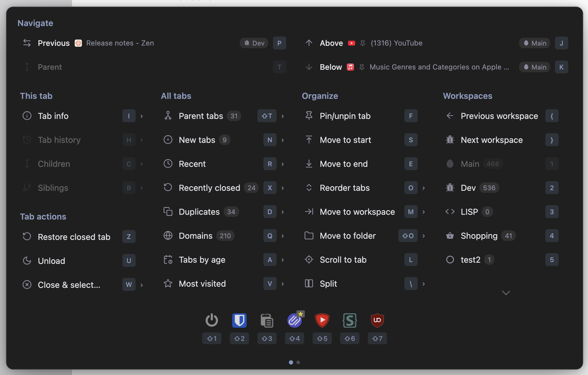

# Zen Tabs Panel

A keyboard-driven tab management extension for [Zen Browser](https://zen-browser.app/) with a command palette UI and optional companion Zen Mods.

> [!CAUTION]
> This extension uses internal Zen APIs which could change and break with any Zen update. Use at your own risk.



## Features

**Command palette** (`Cmd+Option+.` or toolbar icon) - a Zen-styled floating panel with:

- Go to previous tab - jump to the last tab you were on, even across workspaces. Shows workspace indicator when the tab is in a different workspace. Hovering or selecting highlights the tab in the sidebar.
- Go to parent tab - jump to the tab that opened the current one. Shows workspace indicator and sidebar preview on hover/select.
- Child tabs - list all tabs spawned from the current tab
- Sibling tabs - list all tabs that share the same parent as the current tab
- Unvisited tabs - list tabs opened in the background you haven't looked at
- Tabs by last visited - all tabs sorted by recency, with workspace filter toggle (`W` key). Hovering or arrow-keying through any tab list highlights and scrolls to the tab in the sidebar.
- Tab info - detailed view of the current tab: age, memory/CPU usage, visit history (grouped by date, collapsible), and duplicate tab detection with close buttons
- Duplicates - view all duplicate tabs across all workspaces, grouped by URL, with workspace indicators, tab age, hover preview, and close buttons. Duplicate tabs are marked with an amber diamond indicator in the sidebar (aligned with the unread dot indicator).
- Domains - browse tabs grouped by domain with drill-down. Supports workspace filter (`W` key).
- Tabs by age - list all tabs oldest first, grouped by age (today, yesterday, this week, etc.) with close buttons for cleaning up old tabs. Supports workspace filter (`W` key).
- Most visited - list tabs sorted by browser history visit count, most visited first. Supports workspace filter (`W` key).
- Move to workspace - move tabs to another workspace without switching away (placed at top of target workspace's tab list). Supports multiselected tabs (Cmd+click).
- Move tab to start / end of tab bar
- Reorder tabs - submenu with sort options: by recent, by domain (alphabetical or popularity), by age, most visited, inactive at bottom, group duplicates
- Scroll to current tab - scroll the sidebar to center the active tab
- Unload tab - discard from memory
- Settings
- "Copy selected tab URLs" right click menu item when multiple tabs are selected

**Cross-workspace tab switching** - Zen's workspace system isolates tabs at the API level. `browser.tabs.query()` only returns tabs in the current workspace, and `browser.tabs.update()` silently fails for tabs in other workspaces. Every other Firefox tab-switching extension is broken by this. Zen Tabs Panel uses a privileged Experiment API to access Zen's internal workspace APIs directly, making it the only extension that can reliably switch to any tab regardless of which workspace it's in.

**Keyboard shortcuts** (configurable via `about:addons` › Manage Extension Shortcuts):

All global shortcuts use `Ctrl+Option` as the modifier. The letter key matches the in-panel hotkey, so you only need to learn one set of keys. Some keys are reassigned from their natural mnemonic to avoid conflicts with Firefox/Zen built-in shortcuts (see `KEYBINDING_CONFLICTS.md`).

| Action | Global shortcut | Panel key |
|---|---|---|
| Open palette | `Ctrl+Option+Space` | — |
| Previous tab | `Ctrl+Option+P` | `P` |
| Parent tab | — | `⇧P` |
| Children | `Ctrl+Option+C` | `C` |
| Siblings | — | `⇧C` |
| New tabs | `Ctrl+Option+A` | `A` |
| Recent | `Ctrl+Option+R` | `R` |
| Duplicates | `Ctrl+Option+D` | `D` |
| Tab info | `Ctrl+Option+T` | `T` |
| Domains | — | `Q` |
| Tabs by age | — | `J` |
| Most visited | — | `V` |
| Move to workspace | `Ctrl+Option+M` | `M` |
| Move to start | `Ctrl+Option+S` | `S` |
| Move to end | `Ctrl+Option+B` | `B` |
| Reorder tabs | — | `O` |
| Scroll to tab | `Ctrl+Option+F` | `F` |
| Unload tab | `Ctrl+Option+X` | `X` |
| Settings | — | `,` |

**Settings** (accessible from the palette or `about:addons` › Extensions › Zen Tabs Panel › Preferences):

- Auto-close unpinned tabs after a configurable period (24h / 48h / 1 week / 1 month)
- Auto-move active tab to top with configurable delay

**Companion Zen Mods** - optional browser chrome tweaks installable from the settings page:

| Mod | Description |
|---|---|
| Unread Tab Indicator | Blue dot on tabs opened in the background that you haven't visited yet |
| Dim Unloaded Tabs | Grayscale and fade tabs that have been unloaded from memory |
| Corner Bleed Fix | Fixes white corners bleeding through on pages with light backgrounds |
| Split View Header on Hover | Hides the split view toolbar until you hover near the top edge |

Each mod installs as a proper Zen Mod visible in `about:preferences` › Zen Mods, where you can enable/disable them independently.

## Why installation isn't straightforward

This extension uses a Firefox **Experiment API** to access Zen's internal browser APIs (workspace switching, cross-workspace tab management, chrome DOM manipulation). Experiment APIs are a privileged extension mechanism that aren't allowed on the public Firefox Add-ons site (AMO), so the extension can't be distributed through normal channels.

This means two `about:config` flags must be enabled to install it.

## Install

### 1. Set required `about:config` flags

Open `about:config` in Zen and set both of these:

| Flag | Value | Purpose |
|---|---|---|
| `xpinstall.signatures.required` | `false` | Allows installing extensions without a Mozilla signature |
| `extensions.experiments.enabled` | `true` | Allows extensions to use Experiment APIs |

### 2. Install the extension

1. Download `zen-tabs-panel.xpi` from this repo.
2. Open `about:addons` in Zen
3. Click the gear icon (⚙) › **Install Add-on From File...**
4. Select the downloaded `.xpi` file

The extension will persist across browser restarts.

### 3. Install companion mods (optional)

1. Open the command palette (`Cmd+Option+.`) and press `,` to open settings
2. Under **Companion Zen Mods**, click **Install** next to any mods you want
3. The mods will appear in `about:preferences` › Zen Mods where you can toggle them

## Development

### Prerequisites

Set these flags in `about:config`:

| Flag | Value | Purpose |
|---|---|---|
| `xpinstall.signatures.required` | `false` | Allow unsigned extensions |
| `extensions.experiments.enabled` | `true` | Allow Experiment APIs |
| `devtools.chrome.enabled` | `true` | Enable Browser Toolbox |
| `devtools.debugger.remote-enabled` | `true` | Enable remote debugging |

### Loading for development

For iterating on `background.js`, `popup/`, and `options/`:

1. Open `about:debugging#/runtime/this-firefox`
2. Click **Load Temporary Add-on...**
3. Select `extension/manifest.json`
4. Use the **Reload** button after making changes

### Browser Toolbox

The Browser Toolbox is essential for inspecting Zen's chrome DOM, testing CSS selectors, and debugging the experiment API.

1. Open it with `Cmd+Opt+Shift+I` (macOS) or `Ctrl+Option+Shift+I` (Windows/Linux)
2. Accept the incoming connection prompt
3. Use the Console to access browser globals like `gBrowser`, `gZenWorkspaces`, `gZenViewSplitter`, `gZenMods`

### Building from source

```bash
make
```

Then install the `.xpi` from `about:addons` as described above.

### Architecture notes

The extension has three layers:

1. **`experiment/api.js`** - Runs in the chrome-privileged parent process. Has full access to `gBrowser`, `gZenWorkspaces`, `gZenViewSplitter`, `gZenMods`, and the chrome DOM. Exposes a `browser.zenWorkspaces.*` API to the extension. Also manages the command palette overlay (injected as a chrome DOM element with an embedded `<browser>` XUL element).

2. **`background.js`** - Persistent background script. Routes messages between the popup and the experiment API. Handles auto-close timers, auto-move logic, and keyboard command dispatch.

3. **`popup/`** - The command palette UI, loaded inside the chrome overlay's embedded browser element. Communicates with `background.js` via `browser.runtime.sendMessage`.

Key constraints discovered during development:

- `browser.tabs.query()` only returns tabs in the current Zen workspace. The experiment API queries the DOM directly to get all tabs across all workspaces.
- `browser.tabs.update(tabId, {active: true})` silently no-ops for cross-workspace tabs. The experiment API uses `gZenWorkspaces.changeWorkspaceWithID()` then sets `gBrowser.selectedTab`.
- The command palette can't be a `browserAction` popup because XUL panel positioning is C++-level and can't be overridden with CSS (it's a chrome DOM overlay instead).
- The experiment API scope doesn't have web globals like `TextEncoder`, `PathUtils`, or `IOUtils` (these must be accessed from the window object).

## License

MIT
