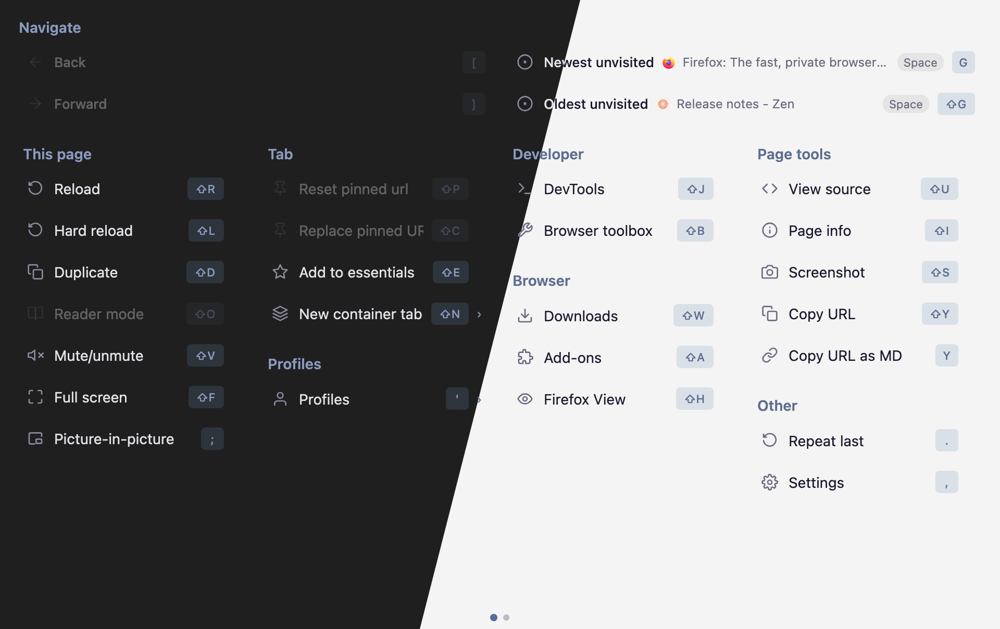
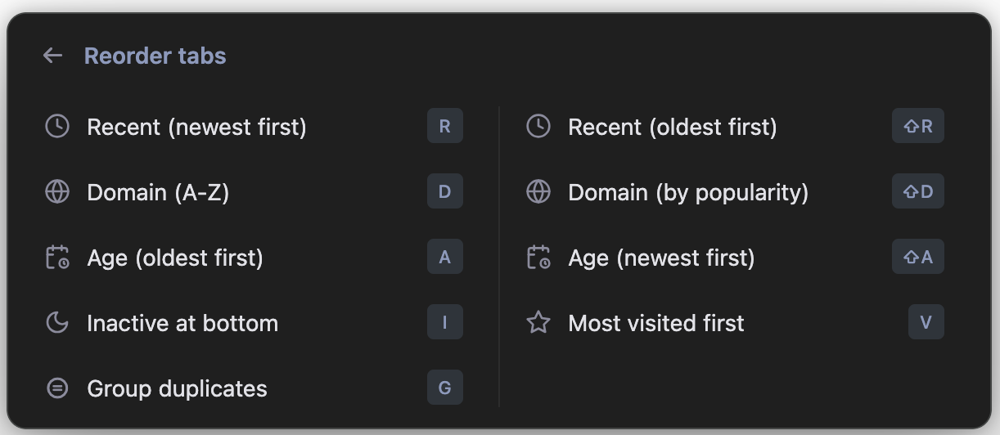
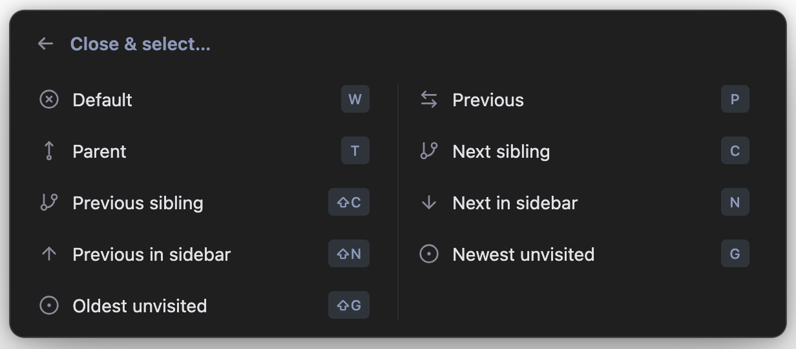
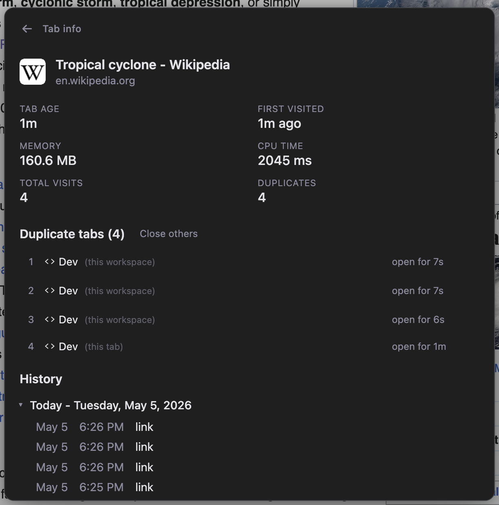

# Zen Tabs Panel

**Version 0.4.0** · Tested on Zen Browser 1.19.11b (Firefox 150.0.1)

A keyboard-driven tab management extension for [Zen Browser](https://zen-browser.app/) with a command palette UI and optional companion Zen Mods.

> [!CAUTION]
> This extension uses internal Zen APIs which could change and break with any Zen update. Use at your own risk.

Zen Tabs Panel gives you keyboard access to far more tab and workspace actions than Zen exposes by default. It is built around one leader shortcut: `⌘.` on macOS, or `⌃.` on Windows/Linux. After pressing the leader, you type a sequence of follow-up keys, one after another, instead of holding a complicated shortcut all at once. For example, `⌘.` then `R` opens recent tabs; `⌘.` then `R` then `2` switches to the second most recent tab. These sequences mirror the same keys you would press when navigating the menu visually. If you type quickly, the action runs immediately without showing the menu. If you pause, the menu appears and shows the available options, helping you find the right key when you forget. Over time, common actions become muscle memory while less-used tools remain easy to discover. The palette is designed for fast keyboard use, but it is also fully mouse-friendly and can be navigated with the arrow keys.

> [!NOTE]
> Windows and Linux have not been tested yet, but should work in theory.










## Features

**Command palette** (`Cmd+.` / `Cmd+Option+.` or toolbar icon) - a Zen-styled floating panel with:

- Navigate panel — a 3×2 grid at the top of the menu showing what tab/page you'd land on for each direction, each with a live preview of the target. Three columns: jumps to known tabs (Previous lastAccessed, Parent opener), browser-style history (Back/Forward in the current tab), and vertical-bar neighbors (Above/Below in the sidebar). Hovering a cell highlights the target in the sidebar; the icon shown is the target tab's favicon when it's a tab.
- Child tabs - list all tabs spawned from the current tab
- Sibling tabs - list all tabs that share the same parent as the current tab
- Parent tabs - list all tabs that have spawned children
- Navigation - back/forward history of the current tab with B/F shortcuts for immediate back/forward
- Unvisited tabs - list tabs opened in the background you haven't looked at
- Tabs by last visited - all tabs sorted by recency. Hovering or arrow-keying through any tab list highlights and scrolls to the tab in the sidebar.
- Tab info - detailed view of the current tab: age, memory/CPU usage, visit history (grouped by date, collapsible), and duplicate tab detection with close buttons
- Duplicates - view all duplicate tabs across all workspaces, grouped by URL, with workspace indicators, tab age, hover preview, and close buttons. Duplicate tabs are marked with an amber "D" badge in the sidebar; unvisited tabs use a matching blue "N" badge.
- Domains - browse tabs grouped by domain with drill-down
- Tabs by age - list all tabs oldest first, grouped by age (today, yesterday, this week, etc.) with close buttons for cleaning up old tabs
- Most visited - list tabs sorted by browser history visit count, most visited first
- Move to workspace - move tabs to another workspace without switching away (placed at top of target workspace's tab list). Supports multiselected tabs (Cmd+click).
- Move tab to start / end of tab bar
- Reorder tabs - submenu with sort options: by recent, by domain (alphabetical or popularity), by age, most visited, inactive at bottom, group duplicates
- Scroll to current tab - scroll the sidebar to center the active tab
- Unload tab - discard from memory
- Close & select - close the current tab and explicitly choose which tab to focus next: default (whatever Cmd+W would do, with the predicted successor previewed live), previous (last-active), parent, next/previous child (sibling sharing the same parent), or next/previous tab in the vertical bar. Each row shows the actual target tab's favicon and title; hover or arrow-key to highlight it in the sidebar; rows with no available target are disabled.
- Pin/unpin tab — toggle pinned state of the active tab (refuses to act on Essentials)
- Copy URL as Markdown — copies the active tab as `[Title](URL)` to the clipboard
- Restore closed tab — reopens the most recently closed tab in this window via SessionStore
- Next/Previous workspace — cycle through workspaces with wraparound
- Split — submenu for Zen's split view: New, Close, Horizontal (top/bottom panes), Vertical (side-by-side panes)
- Settings
- "Copy selected tab URLs" right click menu item when multiple tabs are selected

**Cross-workspace tab switching** - Zen's workspace system isolates tabs at the API level. `browser.tabs.query()` only returns tabs in the current workspace, and `browser.tabs.update()` silently fails for tabs in other workspaces. Every other Firefox tab-switching extension is broken by this. Zen Tabs Panel uses a privileged Experiment API to access Zen's internal workspace APIs directly, making it the only extension that can reliably switch to any tab regardless of which workspace it's in.

**Keyboard shortcuts** (configurable via `about:addons` › Manage Extension Shortcuts):

Press `Cmd+.` to arm the palette/chord engine. `Cmd+Option+.` is registered as a backup leader, and two additional leader slots are available but unset by default. All four commands do the same thing and can be changed in `about:addons` > Manage Extension Shortcuts. From the palette, use single-key shortcuts to navigate:

The main menu groups actions into columns:

**Navigate** (3×2 grid with live previews of the target tab/page):

| Panel key | Action |
|---|---|
| `P` | Previous tab (last-active) |
| `T` | Parent tab (opener) |
| `[` | Back (in this tab's history, page 2) |
| `]` | Forward (in this tab's history, page 2) |
| `J` | Above (tab above current in sidebar) |
| `K` | Below (tab below current in sidebar) |

**This tab** (current-tab-scoped views):

| Panel key | Action |
|---|---|
| `I` | Tab info |
| `H` | Tab history list |
| `C` | Children |
| `B` | Siblings |

**All tabs** (global views):

| Panel key | Action |
|---|---|
| `⇧T` | Parent tabs |
| `N` | New tabs (unvisited) |
| `R` | Recent |
| `X` | Recently closed |
| `D` | Duplicates |
| `Q` | Domains |
| `A` | Tabs by age |
| `V` | Most visited |

**Tab actions**:

| Panel key | Action |
|---|---|
| `Y` | Copy URL as Markdown |
| `Z` | Restore last closed tab |
| `U` | Unload tab |
| `W` | Close & select (submenu) |

**Organize**:

| Panel key | Action |
|---|---|
| `F` | Pin/unpin tab |
| `S` | Move to start |
| `E` | Move to end |
| `O` | Reorder tabs (submenu) |
| `M` | Move to workspace |
| `L` | Scroll to tab |
| `\` | Split view (submenu) |

**Workspaces**:

| Panel key | Action |
|---|---|
| `{` | Previous workspace |
| `}` | Next workspace |
| `1`–`9`, `0` | Switch to workspace 1–10 |

**Other**:

| Panel key | Action |
|---|---|
| `,` | Settings |

**Chord shortcuts** - the same keys work as leader-key chords. Press a leader (`Cmd+.`, `Cmd+Option+.`, or any configured backup) followed by a panel key within the chord timeout to fire the action without the menu appearing:

- `Cmd+. P` / `T` - jump to previous tab / parent tab, no menu shown
- `Cmd+. [` / `]` - back / forward in the current tab's history (like the browser back/forward buttons)
- `Cmd+. J` / `K` - jump to the tab visually above / below the current tab in the vertical sidebar
- `Cmd+. {` / `}` - previous / next workspace (with wraparound)
- `Cmd+. D` - open the Duplicates submenu directly, skipping the main menu
- `Cmd+. O R` - sort tabs by recent newest (any of the reorder mnemonics work after `O` — `R`/`⇧R`, `D`/`⇧D`, `A`/`⇧A`, `I`, `V`, `G`)
- `Cmd+. W W` - close current tab, browser picks next (Cmd+W equivalent)
- `Cmd+. W P` / `T` / `C` / `⇧C` / `N` / `⇧N` - close current tab and jump to previous / parent / next-or-previous sibling / next-or-previous in the sidebar. Pause after `W` to see a menu of all options with live previews of the target tab in each row.
- `Cmd+. \ N` / `C` / `H` / `V` - split view: new, close, horizontal (top/bottom), vertical (side-by-side). Pause after `\` for the menu.
- `Cmd+. F` - toggle pin on current tab
- `Cmd+. Y` - copy current URL as Markdown link
- `Cmd+. Z` - restore the most recently closed tab
- `Cmd+. 1` … `9`, `0` - switch directly to workspace 1–10
- `Cmd+. S` / `E` / `L` / `U` / `,` - move to start/end, scroll to current, unload, settings

If you don't press a follow-up key, the main menu opens after the timeout. Pressing any unrecognized key or Escape during the chord window cancels silently. Toolbar clicks bypass the chord and open the menu immediately.

**Workspace filtering** - In tab list views, a sidebar shows workspace icons. Press `⇧1`–`⇧9` to filter the list by the 1st–9th workspace, or `0` to toggle between "all workspaces" and the current one. Tab/Shift-Tab moves focus between the list and the sidebar.

**Settings** (accessible from the palette or `about:addons` › Extensions › Zen Tabs Panel › Preferences):

- Auto-close unpinned tabs after a configurable period (24h / 48h / 1 week / 1 month)
- Auto-move active tab to top with configurable delay

**Companion Zen Mods** - optional browser chrome tweaks installable from the settings page:

| Mod | Description |
|---|---|
| Unread Tab Indicator | Blue dot on tabs opened in the background that you haven't visited yet |
| Dim Unloaded Tabs | Grayscale and fade tabs that have been unloaded from memory |
| Corner Bleed Fix | Fixes white corners bleeding through on pages with light backgrounds |
| Split View Header on Hover | Hides the split view toolbar until you hover near the top edge |

Each mod installs as a proper Zen Mod visible in `about:preferences` › Zen Mods, where you can enable/disable them independently.

## Why installation isn't straightforward

This extension uses a Firefox **Experiment API** to access Zen's internal browser APIs (workspace switching, cross-workspace tab management, chrome DOM manipulation). Experiment APIs are a privileged extension mechanism that aren't allowed on the public Firefox Add-ons site (AMO), so the extension can't be distributed through normal channels.

This means two `about:config` flags must be enabled to install it.

## Install

### Quick install (macOS)

```sh
/bin/sh -c "$(curl -fsSL https://raw.githubusercontent.com/cfilipov/zen-tabs-panel/main/install.sh)"
```

This automatically sets the required `about:config` flags, downloads the latest release, and installs it into your Zen profile. Run the same command to update. Restart Zen after installing.

### Manual install

#### 1. Set required `about:config` flags

Open `about:config` in Zen and set both of these:

| Flag | Value | Purpose |
|---|---|---|
| `xpinstall.signatures.required` | `false` | Allows installing extensions without a Mozilla signature |
| `extensions.experiments.enabled` | `true` | Allows extensions to use Experiment APIs |

#### 2. Install the extension

1. Download `zen-tabs-panel.xpi` from the [latest release](../../releases/latest).
2. Open `about:addons` in Zen
3. Click the gear icon (⚙) › **Install Add-on From File...**
4. Select the downloaded `.xpi` file

The extension will persist across browser restarts.

#### 3. Install companion mods (optional)

1. Open the command palette (`Cmd+Option+.`) and press `,` to open settings
2. Under **Companion Zen Mods**, click **Install** next to any mods you want
3. The mods will appear in `about:preferences` › Zen Mods where you can toggle them

## Development

### Prerequisites

Set these flags in `about:config`:

| Flag | Value | Purpose |
|---|---|---|
| `xpinstall.signatures.required` | `false` | Allow unsigned extensions |
| `extensions.experiments.enabled` | `true` | Allow Experiment APIs |
| `devtools.chrome.enabled` | `true` | Enable Browser Toolbox |
| `devtools.debugger.remote-enabled` | `true` | Enable remote debugging |

### Loading for Development

Build the extension, then load the generated `dist/` directory:

```bash
npm run build
```

1. Open `about:debugging#/runtime/this-firefox`
2. Click **Load Temporary Add-on...**
3. Select `dist/manifest.json`
4. Rebuild and use the **Reload** button after making changes

### Remote debugging

To enable remote debugging in Zen. Open about:config and set these two preferences:                          
                                                                                                                        
- devtools.debugger.remote-enabled → true                                                                             
- devtools.chrome.enabled → true                                                                                      
                                                                                                                        
Then restart Zen with the remote debugging port flag. You can do that by quitting Zen and running:                    

```bash   
/Applications/Zen.app/Contents/MacOS/zen --start-debugger-server 6000
```

### Browser Toolbox

The Browser Toolbox is essential for inspecting Zen's chrome DOM, testing CSS selectors, and debugging the experiment API.

1. Open it with `Cmd+Opt+Shift+I` (macOS) or `Ctrl+Option+Shift+I` (Windows/Linux)
2. Accept the incoming connection prompt
3. Use the Console to access browser globals like `gBrowser`, `gZenWorkspaces`, `gZenViewSplitter`, `gZenMods`

### Building from source

```bash
npm run build
make package
```

`npm run build` and `make build` write the Svelte source from `src/` to
`dist/` only. `make package` builds the extension and zips `dist/` into
`zen-tabs-panel.xpi`. Install the `.xpi` from `about:addons` as described above.

### Architecture notes

The extension has three layers:

1. **`src/experiment/api.js`** - Runs in the chrome-privileged parent process. Has full access to `gBrowser`, `gZenWorkspaces`, `gZenViewSplitter`, `gZenMods`, and the chrome DOM. Exposes a `browser.zenWorkspaces.*` API to the extension. Also manages the command palette overlay (injected as a chrome DOM element with an embedded `<browser>` XUL element).

2. **`src/background.js`** - Persistent background script. Routes messages between the popup and the experiment API. Handles auto-close timers, auto-move logic, and keyboard command dispatch.

3. **`src/popup/`** - The Svelte command palette UI, loaded inside the chrome overlay's embedded browser element. Communicates with `background.js` via `browser.runtime.sendMessage`.

Key constraints discovered during development:

- `browser.tabs.query()` only returns tabs in the current Zen workspace. The experiment API queries the DOM directly to get all tabs across all workspaces.
- `browser.tabs.update(tabId, {active: true})` silently no-ops for cross-workspace tabs. The experiment API uses `gZenWorkspaces.changeWorkspaceWithID()` then sets `gBrowser.selectedTab`.
- The command palette can't be a `browserAction` popup because XUL panel positioning is C++-level and can't be overridden with CSS (it's a chrome DOM overlay instead).
- The experiment API scope doesn't have web globals like `TextEncoder`, `PathUtils`, or `IOUtils` (these must be accessed from the window object).

## License

MIT
